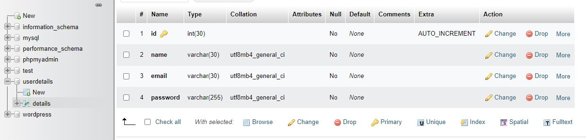

# form_validation
a general form validation using PHP and MySQL

<pre>
<b>Pre-requisites are :<b/>

1. XAMPP server
2. if you have locally installed MySQL the stop the process from 
   CTRL+R  -> services.msc -> MySQL 
   then stop the process
<pre/>
                
<h2>Download <a href="https://www.apachefriends.org/">XAMPP<a/><h2/>

<pre>
<b>How to run : <b/>
                
1. download and extract the zip file from my repo
2. dump the folder in the location "C:\xampp\htdocs\"
3. then run the XAMPP server start the Apache and MySQL 
4. the open the browser type "localhost/Folder_Name/index.php"

Note:
        you must create database name as "userdetails" in phpMyadmin
        and must create table name as "details"
        and add columns as "name" , "email" , "password"
        should be same as below
        
        
       

<pre/>
    

        
